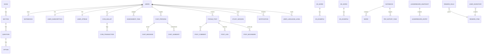

# THIẾT KẾ CƠ SỞ DỮ LIỆU — XIAOYUEDICT

> **Database Engine:** PostgreSQL 16 + pgvector extension
> **ORM:** Django 4.2+ (migration-first approach)
> **Phiên bản tài liệu:** 1.0 | Cập nhật: 2026-07-25

---

## 1. Tổng Quan Kiến Trúc Dữ Liệu

Hệ thống sử dụng **PostgreSQL 16** với extension `pgvector` để hỗ trợ vector similarity search cho tính năng AI Chat RAG. Toàn bộ schema được quản lý bởi Django ORM migrations.

### 1.1. Phân Nhóm Module Dữ Liệu



### 1.2. Quy Ước Chung

| Quy ước | Chi tiết |
|---|---|
| **Primary Key** | UUID v4 (`models.UUIDField(primary_key=True, default=uuid.uuid4)`) cho tất cả models |
| **Timestamps** | `created_at` (auto_now_add), `updated_at` (auto_now) |
| **Soft Delete** | Sử dụng `is_hidden` flag thay vì xóa cứng (Community module) |
| **Naming** | snake_case cho tables, camelCase cho JSON fields |
| **FK Convention** | `on_delete=CASCADE` mặc định, `SET_NULL` cho optional references |

---

## 2. Module: Users (Quản lý Người dùng)

### 2.1. Bảng `users_customuser`

Kế thừa `AbstractUser` của Django, bổ sung Firebase Authentication.

| Cột | Kiểu | Ràng buộc | Mô tả |
|---|---|---|---|
| `id` | UUID | PK | UUID v4, tự sinh |
| `username` | VARCHAR(150) | UNIQUE, NOT NULL | Tên đăng nhập (kế thừa AbstractUser) |
| `email` | VARCHAR(254) | UNIQUE | Email đăng nhập |
| `password` | VARCHAR(128) | NOT NULL | Mật khẩu đã hash |
| `bio` | TEXT | NULLABLE | Tiểu sử ngắn |
| `avatar` | VARCHAR(100) | NULLABLE | Đường dẫn file avatar (`avatars/`) |
| `firebase_uid` | VARCHAR(128) | UNIQUE, NULLABLE | Firebase UID liên kết |
| `is_active` | BOOLEAN | DEFAULT TRUE | Trạng thái kích hoạt |
| `date_joined` | TIMESTAMP | auto | Ngày tạo tài khoản |

---

## 3. Module: Dictionary (Từ điển)

### 3.1. Bảng `dictionary_zh_zhword` — Từ vựng tiếng Trung

| Cột | Kiểu | Ràng buộc | Mô tả |
|---|---|---|---|
| `id` | UUID | PK | UUID v5 sinh từ `word` |
| `word` | VARCHAR(50) | INDEX | Từ vựng giản thể (VD: 爱) |
| `traditional` | VARCHAR(50) | — | Phồn thể (VD: 愛) |
| `pinyin` | VARCHAR(100) | INDEX | Pinyin có dấu (VD: ài) |
| `toneless_pinyin` | VARCHAR(100) | INDEX | Pinyin không dấu (VD: ai) |
| `han_viet` | VARCHAR(100) | INDEX | Hán Việt (VD: Ái) |
| `translation_vi` | TEXT | NOT NULL | Dịch nghĩa tiếng Việt |
| `translation_en` | TEXT | — | Dịch nghĩa tiếng Anh |
| `part_of_speech` | JSONB | DEFAULT [] | Từ loại: `["verb", "noun"]` |
| `hsk_level` | VARCHAR(10) | INDEX | Cấp HSK: "1"..."7-8-9" |
| `radical` | JSONB | DEFAULT [] | Bộ thủ |
| `stroke_number` | JSONB | DEFAULT [] | Số nét |
| `components` | JSONB | DEFAULT [] | Thành phần cấu tạo chữ |
| `synonyms` | JSONB | DEFAULT [] | Từ đồng nghĩa |
| `antonyms` | JSONB | DEFAULT [] | Từ trái nghĩa |
| `tags` | JSONB | DEFAULT [] | Nhãn ngữ nghĩa |
| `word_frequency` | FLOAT | DEFAULT 0.0 | Tần suất sử dụng |
| `popularity_rank` | INTEGER | DEFAULT 0 | Xếp hạng phổ biến |
| `audio_url` | VARCHAR(500) | — | URL file phát âm |
| `image_url` | VARCHAR(500) | — | URL hình minh họa |

**Ràng buộc:**
- `UNIQUE (word, pinyin, hsk_level)`

**Chỉ mục (Indexes):**
- `GIN(translation_vi)` — opclass `gin_trgm_ops` — Tìm kiếm mờ tiếng Việt
- `GIN(han_viet)` — opclass `gin_trgm_ops` — Tìm kiếm Hán Việt
- `GIN(toneless_pinyin)` — opclass `gin_trgm_ops` — Tìm kiếm pinyin
- `GIN(radical)` — opclass `jsonb_path_ops` — Truy vấn bộ thủ

### 3.2. Bảng `dictionary_zh_zhexample` — Câu ví dụ tiếng Trung

| Cột | Kiểu | Ràng buộc | Mô tả |
|---|---|---|---|
| `id` | UUID | PK | UUID v4 |
| `word_id` | UUID | FK → `ZhWord` CASCADE | Từ vựng cha |
| `chinese` | TEXT | NOT NULL | Câu ví dụ tiếng Trung |
| `pinyin` | TEXT | NOT NULL | Phiên âm |
| `vietnamese` | TEXT | NOT NULL | Dịch tiếng Việt |
| `audio_url` | VARCHAR(500) | — | URL audio phát âm |
| `search_vector` | tsvector | NULLABLE | FTS vector (jieba tokenized) |

**Chỉ mục:**
- `GIN(search_vector)` — Full-text search
- `GIN(vietnamese)` — opclass `gin_trgm_ops` — Tìm kiếm mờ

### 3.3. Bảng `dictionary_en_enword` — Từ vựng tiếng Anh

| Cột | Kiểu | Ràng buộc | Mô tả |
|---|---|---|---|
| `id` | UUID | PK | UUID v5 sinh từ `word` |
| `word` | VARCHAR(100) | UNIQUE, INDEX | Từ tiếng Anh |
| `ipa` | VARCHAR(100) | — | Phiên âm IPA |
| `translation_vi` | TEXT | — | Dịch nghĩa tiếng Việt (fallback) |
| `definitions` | JSONB | DEFAULT [] | Danh sách định nghĩa chi tiết |
| `part_of_speech` | JSONB | DEFAULT [] | Từ loại |
| `cefr_level` | VARCHAR(10) | INDEX | Cấp CEFR (A1→C2) |
| `core_inventory_1` | VARCHAR(255) | — | CEFR Profile |
| `core_inventory_2` | VARCHAR(255) | — | CEFR Profile |
| `threshold` | VARCHAR(255) | — | CEFR threshold |
| `notes` | TEXT | — | Ghi chú bổ sung |
| `image_caption` | TEXT | — | Mô tả hình (dùng làm prompt AI) |
| `audio_url` | VARCHAR(500) | — | URL phát âm |
| `image_url` | VARCHAR(500) | — | URL hình minh họa |

**Chỉ mục:**
- `B-tree(LOWER(word))` — Tìm exact/prefix match
- `GIN(translation_vi)` — opclass `gin_trgm_ops`

### 3.4. Bảng `dictionary_en_enexample` — Câu ví dụ tiếng Anh

| Cột | Kiểu | Ràng buộc | Mô tả |
|---|---|---|---|
| `id` | UUID | PK | |
| `word_id` | UUID | FK → `EnWord` CASCADE | |
| `english` | TEXT | NOT NULL | Câu ví dụ |
| `vietnamese` | TEXT | NOT NULL | Dịch tiếng Việt |
| `audio_url` | VARCHAR(500) | — | |
| `search_vector` | tsvector | NULLABLE | FTS config `english` |

---

## 4. Module: Assessments (Đánh giá Phát âm)

### 4.1. Bảng `assessments_assessmenttask`

| Cột | Kiểu | Ràng buộc | Mô tả |
|---|---|---|---|
| `id` | UUID | PK | |
| `user_id` | UUID | FK → `CustomUser` SET_NULL, NULLABLE | Guest = NULL |
| `audio_file` | VARCHAR(100) | NOT NULL | File path (`audio_temp/`) |
| `target_text` | TEXT | DEFAULT '' | Văn bản gốc để so sánh |
| `language` | VARCHAR(5) | CHECK (en/zh), DEFAULT 'en' | Ngôn ngữ đánh giá |
| `status` | VARCHAR(20) | CHECK (PENDING/PROCESSING/COMPLETED/FAILED) | Trạng thái pipeline |
| `refund_status` | VARCHAR(20) | INDEX, DEFAULT 'NOT_REFUNDED' | Trạng thái hoàn trả coin |
| `queue_name` | VARCHAR(20) | INDEX, DEFAULT 'queue_guest' | Queue Celery xử lý |
| `score` | FLOAT | NULLABLE | Điểm phát âm AI (0-100) |
| `result_data` | JSONB | NULLABLE | Kết quả chi tiết từ AI service |
| `error_message` | TEXT | DEFAULT '' | Thông báo lỗi (nếu FAILED) |
| `created_at` | TIMESTAMP | auto | |

---

## 5. Module: Exams (Quản lý Đề thi)

### 5.1. Bảng `exams_exam`

| Cột | Kiểu | Ràng buộc | Mô tả |
|---|---|---|---|
| `id` | BIGINT | PK (auto) | Django auto field |
| `exam_id` | VARCHAR(100) | UNIQUE | VD: HSK1_NEW_UUID_003 |
| `exam_name` | VARCHAR(500) | NOT NULL | Tên đề thi |
| `exam_version` | VARCHAR(20) | DEFAULT "1.0" | |
| `level` | VARCHAR(20) | NOT NULL | HSK 1, HSK 3, HSK 4... |
| `total_questions` | INTEGER | DEFAULT 0 | |
| `total_time_minutes` | INTEGER | DEFAULT 0 | Thời gian thi (phút) |
| `total_score` | INTEGER | DEFAULT 0 | Tổng điểm tối đa |
| `passing_score` | INTEGER | DEFAULT 0 | Điểm đạt |
| `language` | VARCHAR(5) | CHECK (en/zh) | Ngôn ngữ đề |
| `allow_resume` | BOOLEAN | DEFAULT TRUE | Cho phép tiếp tục thi |
| `max_attempts` | INTEGER | DEFAULT -1 | -1 = không giới hạn |
| `shuffle_questions` | BOOLEAN | DEFAULT FALSE | Trộn câu hỏi |
| `shuffle_options` | BOOLEAN | DEFAULT FALSE | Trộn đáp án |
| `show_explanation_after` | VARCHAR(50) | DEFAULT 'exam_submitted' | |
| `status` | INTEGER | DEFAULT 1 | |
| `created_at` | TIMESTAMP | auto | |
| `updated_at` | TIMESTAMP | auto | |

**Cache Eviction:** Signal `post_save`/`post_delete` → clear Redis cache key.

### 5.2. Bảng `exams_section`

| Cột | Kiểu | Ràng buộc | Mô tả |
|---|---|---|---|
| `id` | BIGINT | PK | |
| `exam_id` | BIGINT | FK → `Exam` CASCADE | |
| `section_id` | VARCHAR(100) | UNIQUE(exam, section_id) | VD: sec_listening_01 |
| `section_name` | VARCHAR(50) | CHECK (Listening/Reading/Writing) | |
| `part_number` | INTEGER | NOT NULL | Phần 1, 2, 3... |
| `instruction` | TEXT | DEFAULT '' | Hướng dẫn bằng tiếng Trung |
| `section_audio_url` | VARCHAR(500) | — | URL audio chung |
| `passage` | JSONB | NULLABLE | Đoạn văn đọc hiểu |
| `ordering` | INTEGER | DEFAULT 0 | |

### 5.3. Bảng `exams_question`

| Cột | Kiểu | Ràng buộc | Mô tả |
|---|---|---|---|
| `id` | BIGINT | PK | |
| `section_id` | BIGINT | FK → `Section` CASCADE | |
| `question_id` | VARCHAR(100) | UNIQUE(section, question_id) | |
| `question_type` | VARCHAR(30) | CHECK | true_false / multiple_choice / fill_blank / matching / ordering / essay |
| `difficulty` | VARCHAR(20) | CHECK (easy/medium/hard) | |
| `points` | INTEGER | DEFAULT 5 | Điểm cho câu |
| `tags` | JSONB | DEFAULT [] | |
| `audio_url` | VARCHAR(500) | — | Audio riêng |
| `audio_start_time` | VARCHAR(20) | — | Mốc bắt đầu (00:01:30) |
| `audio_end_time` | VARCHAR(20) | — | Mốc kết thúc |
| `audio_script` | TEXT | — | Nội dung bài nghe |
| `question_text` | TEXT | — | Câu hỏi hiển thị |
| `image_url` | VARCHAR(500) | — | Hình ảnh đề bài |
| `image_description` | TEXT | — | Mô tả hình ảnh |
| `correct_answer` | VARCHAR(50) | NOT NULL | ID đáp án đúng |
| `explanation` | TEXT | — | Giải thích |
| `ordering` | INTEGER | DEFAULT 0 | |

### 5.4. Bảng `exams_option`

| Cột | Kiểu | Ràng buộc | Mô tả |
|---|---|---|---|
| `id` | BIGINT | PK | |
| `question_id` | BIGINT | FK → `Question` CASCADE | |
| `option_id` | VARCHAR(50) | UNIQUE(question, option_id) | VD: opt_A, opt_True |
| `text` | TEXT | DEFAULT '' | Nội dung chữ |
| `image_url` | VARCHAR(500) | — | Hình ảnh đáp án |
| `image_description` | TEXT | — | |
| `ordering` | INTEGER | DEFAULT 0 | |

---

## 6. Module: Notes (Sổ tay Từ vựng)

### 6.1. Bảng `notes_notebook`

| Cột | Kiểu | Ràng buộc | Mô tả |
|---|---|---|---|
| `id` | UUID | PK | |
| `user_id` | UUID | FK → `CustomUser` CASCADE, NULLABLE | NULL = system notebook |
| `name` | VARCHAR(255) | NOT NULL | Tên sổ |
| `description` | TEXT | DEFAULT '' | |
| `lang` | VARCHAR(10) | CHECK (zh/en), DEFAULT 'zh' | |
| `created_at` | TIMESTAMP | auto | |
| `updated_at` | TIMESTAMP | auto | |

### 6.2. Bảng `notes_word`

| Cột | Kiểu | Ràng buộc | Mô tả |
|---|---|---|---|
| `id` | UUID | PK | |
| `notebook_id` | UUID | FK → `Notebook` CASCADE | |
| `vocabulary` | VARCHAR(255) | NOT NULL | Từ vựng |
| `pinyin` | VARCHAR(255) | DEFAULT '' | Bính âm |
| `meaning` | TEXT | DEFAULT '' | Nghĩa |
| `note` | TEXT | DEFAULT '' | Ghi chú |
| `is_mastered` | BOOLEAN | DEFAULT FALSE | Đã thuộc |
| `created_at` / `updated_at` | TIMESTAMP | auto | |

### 6.3. Bảng `notes_pdfexporttask`

| Cột | Kiểu | Ràng buộc | Mô tả |
|---|---|---|---|
| `id` | UUID | PK | |
| `user_id` | UUID | FK → `CustomUser` CASCADE | |
| `notebook_id` | UUID | FK → `Notebook` CASCADE | |
| `status` | VARCHAR(20) | CHECK | PENDING / PROCESSING / COMPLETED / FAILED |
| `queue_name` | VARCHAR(20) | INDEX | queue_paid / queue_free |
| `pdf_file` | VARCHAR(100) | NULLABLE | File path (`pdf_exports/`) |
| `error_message` | TEXT | DEFAULT '' | |
| `created_at` / `updated_at` | TIMESTAMP | auto | |

---

## 7. Module: Flashcard Exercises (Bài tập)

### 7.1. Bảng `flashcard_exercises_flashcardexercise`

| Cột | Kiểu | Ràng buộc | Mô tả |
|---|---|---|---|
| `id` | UUID | PK | |
| `word` | VARCHAR(255) | INDEX | Từ vựng gốc |
| `lang` | VARCHAR(10) | CHECK (zh/en) | |
| `exercise_type` | VARCHAR(20) | CHECK (reading/listening) | |
| `content` | JSONB | NOT NULL | Nội dung bài tập AI-gen |
| `audio_url` | VARCHAR(200) | DEFAULT '' | Audio cho tab Nghe |
| `created_at` | TIMESTAMP | auto | |

**Composite Indexes:**
- `(word, lang)`
- `(word, lang, exercise_type)`

### 7.2. Bảng `flashcard_exercises_userflashcardhistory`

| Cột | Kiểu | Ràng buộc | Mô tả |
|---|---|---|---|
| `id` | UUID | PK | |
| `user_id` | UUID | FK → `CustomUser` CASCADE | |
| `exercise_id` | UUID | FK → `FlashcardExercise` CASCADE | |
| `word` | VARCHAR(255) | INDEX | Từ vựng |
| `lang` | VARCHAR(10) | | |
| `exercise_type` | VARCHAR(20) | | |
| `completed_at` | TIMESTAMP | auto | |

**Index:** `(user, word, lang, exercise_type)`

### 7.3. Bảng `flashcard_exercises_writingtask`

| Cột | Kiểu | Ràng buộc | Mô tả |
|---|---|---|---|
| `id` | UUID | PK | |
| `user_id` | UUID | FK → `CustomUser` CASCADE | |
| `task_type` | VARCHAR(20) | CHECK (general/deep_practice) | |
| `sentence` | TEXT | NOT NULL | Đoạn văn do học sinh viết |
| `target_word` | VARCHAR(255) | DEFAULT '' | Từ vựng mục tiêu |
| `lang` | VARCHAR(10) | DEFAULT 'zh' | |
| `status` | VARCHAR(15) | CHECK (PENDING/SUCCESS/FAILED) | |
| `cost` | INTEGER | DEFAULT 0 | Số coin đã khấu trừ |
| `result_data` | JSONB | NULLABLE | Kết quả chấm AI |
| `error_message` | TEXT | DEFAULT '' | |
| `created_at` | TIMESTAMP | auto | |

---

## 8. Module: Subscriptions (Đăng ký & Thanh toán)

### 8.1. Bảng `subscriptions_subscriptionplan`

| Cột | Kiểu | Ràng buộc | Mô tả |
|---|---|---|---|
| `id` | UUID | PK | |
| `tier` | VARCHAR(20) | UNIQUE, CHECK (Free/Plus/Pro/Premium) | Gói đăng ký |
| `price` | DECIMAL(10,2) | DEFAULT 0.00 | Giá gốc |
| `vat` | DECIMAL(5,2) | DEFAULT 0.00 | Tỷ lệ VAT (%) |
| `description` | TEXT | DEFAULT '' | Mô tả quyền lợi |

### 8.2. Bảng `subscriptions_usersubscription`

| Cột | Kiểu | Ràng buộc | Mô tả |
|---|---|---|---|
| `id` | UUID | PK | |
| `user_id` | UUID | ONE-TO-ONE → `CustomUser` CASCADE | |
| `tier` | VARCHAR(20) | CHECK, DEFAULT 'Free' | Gói hiện tại |
| `start_date` | TIMESTAMP | DEFAULT NOW | |
| `end_date` | TIMESTAMP | NULLABLE | NULL = vĩnh viễn |
| `is_active` | BOOLEAN | DEFAULT TRUE | |
| `price` | DECIMAL(10,2) | | Giá snapshot tại thời điểm mua |
| `vat` | DECIMAL(5,2) | | VAT snapshot |
| `pending_downgrade_tier` | VARCHAR(20) | NULLABLE | Gói chuyển xuống khi hết hạn |

### 8.3. Bảng `subscriptions_subscriptionhistory`

Ghi lại mọi thay đổi gói (UPGRADE / RENEW / DOWNGRADE / CANCEL).

### 8.4. Bảng `subscriptions_volumelimitconfig`

Cấu hình giới hạn bandwidth/sử dụng theo tier (MB/phút, MB/giờ, MB/ngày, PDF limits, Translation limits).

### 8.5. Bảng `subscriptions_paymentorder`

| Cột | Kiểu | Ràng buộc | Mô tả |
|---|---|---|---|
| `id` | UUID | PK | |
| `user_id` | UUID | FK → `CustomUser` CASCADE | |
| `target_tier` | VARCHAR(20) | | Gói muốn nâng cấp |
| `amount` | DECIMAL(12,0) | | Số tiền VNĐ |
| `order_code` | VARCHAR(50) | UNIQUE, INDEX | VD: CNEN-abc12345 |
| `transfer_content` | VARCHAR(100) | | Nội dung chuyển khoản |
| `status` | VARCHAR(10) | CHECK (PENDING/PAID/EXPIRED/FAILED) | |
| `sepay_transaction_id` | VARCHAR(100) | DEFAULT '' | ID giao dịch SePay |
| `bank_reference` | VARCHAR(100) | DEFAULT '' | |
| `created_at` | TIMESTAMP | auto | |
| `expires_at` | TIMESTAMP | NOT NULL | Thời điểm hết hạn đơn |
| `paid_at` | TIMESTAMP | NULLABLE | |

---

## 9. Module: Gamification (Game hóa)

### 9.1. Bảng `gamification_userstreak` — Chuỗi học tập
- ONE-TO-ONE với `CustomUser`
- Fields: `current_streak`, `max_streak`

### 9.2. Bảng `gamification_dailytarget` — Mục tiêu hàng ngày
- ONE-TO-ONE với `CustomUser`
- Fields: `target_words` (default 10), `target_duration` (phút), `target_type`

### 9.3. Bảng `gamification_studyhistory` — Lịch sử học tập
- UNIQUE(user, study_date)
- Fields: `vocabulary_learned`, `pronunciation_accuracy`, `study_duration_seconds`

### 9.4. Bảng `gamification_dailyactivity` — Hoạt động ngày
- UNIQUE(user, activity_date)
- Fields: `is_target_met`

### 9.5. Bảng `gamification_coinwallet` — Ví điểm thưởng

| Cột | Kiểu | Ràng buộc | Mô tả |
|---|---|---|---|
| `id` | UUID | PK | |
| `user_id` | UUID | FK CASCADE | |
| `lang` | VARCHAR(10) | CHECK (zh/en) | zh = Linh Thạch, en = Coin |
| `paid_balance` | INTEGER | DEFAULT 0 | Coin refill/mua — trừ trước |
| `free_balance` | INTEGER | DEFAULT 0 | Coin kiếm từ học — trừ sau |
| `shop_balance` | INTEGER | DEFAULT 0 | Thần Thạch / Đá Quý |
| `updated_at` | TIMESTAMP | auto | |

**Constraint:** `UNIQUE(user, lang)`

### 9.6. Bảng `gamification_cointransaction` — Lịch sử giao dịch coin

| Cột | Kiểu | Ràng buộc | Mô tả |
|---|---|---|---|
| `id` | UUID | PK | |
| `group_id` | UUID | INDEX | Nhóm giao dịch (split spend) |
| `wallet_id` | UUID | FK CASCADE | |
| `user_id` | UUID | FK CASCADE | |
| `transaction_type` | VARCHAR(30) | CHECK | EARN_STUDY, SPEND_CHAT_CREATE, SPEND_CHAT_MSG, REFUND, WEEKLY_REFILL, PURCHASE, SHOP_PURCHASE... |
| `balance_type` | VARCHAR(10) | CHECK (paid/free/shop) | Nguồn bị tác động |
| `amount` | INTEGER | | Dương = cộng, Âm = trừ |
| `paid_balance_after` | INTEGER | | Snapshot sau giao dịch |
| `free_balance_after` | INTEGER | | |
| `shop_balance_after` | INTEGER | DEFAULT 0 | |
| `reference_id` | VARCHAR(255) | DEFAULT '' | |
| `note` | TEXT | DEFAULT '' | |
| `created_at` | TIMESTAMP | auto, INDEX | |

### 9.7. Bảng `gamification_coinconfig` — Cấu hình chi phí theo tier

Admin-configurable: `weekly_refill_cap`, `initial_coins_zh/en`, `words_per_coin`, `daily_free_earn_limit`, `chat_create_cost`, `chat_message_cost`, `writing_base_cost_zh/en`, `pdf_normal_export_cost`, `pdf_stroke_export_cost`...

### 9.8. Bảng `gamification_studysession` & `gamification_studysessioncard`

Tracking session lật thẻ flashcard: trạng thái (IN_PROGRESS / FINISHED / ABANDONED), thẻ đã lật (memorized / skipped).

### 9.9. Bảng `gamification_coinpurchaseorder` — Mua coin bằng tiền

Tương tự `PaymentOrder` nhưng cho mua coin qua SePay.

### 9.10. Bảng `gamification_userlanguagelevel` — EXP & Level

| Cột | Kiểu | Ràng buộc | Mô tả |
|---|---|---|---|
| `id` | UUID | PK | |
| `user_id` | UUID | FK CASCADE | |
| `lang` | VARCHAR(10) | CHECK (zh/en) | |
| `level` | INTEGER | DEFAULT 1 | Level hiện tại |
| `current_exp` | INTEGER | DEFAULT 0 | EXP trong level hiện tại |
| `total_exp` | INTEGER | DEFAULT 0 | Tổng EXP tích lũy (không giảm) |

**Constraint:** `UNIQUE(user, lang)`

### 9.11. Bảng `gamification_exptransaction` — Audit trail EXP

Ghi nhận mọi thay đổi EXP với `idempotency_key` unique để tránh duplicate processing khi Celery retry.

### 9.12. Bảng `gamification_rewarditem` — Vật phẩm phần thưởng

Danh mục vật phẩm: avatar_frame, title, bonus_coins, item, badge. Thuộc tính rarity (common → legendary), giá bán (price_free, price_paid, price_shop).

### 9.13. Bảng `gamification_rewardrule` — Quy tắc thưởng level

UNIQUE(lang, required_level, reward_item): Khi đạt level X ngôn ngữ Y → nhận RewardItem Z.

### 9.14. Bảng `gamification_userinventory` — Kho vật phẩm user

Inventory với `is_equipped` flag, `quantity`, liên kết `source_rule`.

### 9.15. Bảng `gamification_levelrewardlog` — Log phần thưởng đã phát

UNIQUE(user, lang, level, reward_rule) — Idempotent: tránh trao trùng.

---

## 10. Module: XiaoYue Chat (AI Tutor)

### 10.1. Bảng `xiaoyue_chat_chatpersona`

| Cột | Kiểu | Ràng buộc | Mô tả |
|---|---|---|---|
| `id` | UUID | PK | |
| `user_id` | UUID | FK CASCADE, INDEX | |
| `agent_name` | VARCHAR(100) | | Tên AI Tutor |
| `agent_birth_year` | INTEGER | NULLABLE | Năm sinh nhân vật |
| `age_diff` | INTEGER | NULLABLE | Chênh lệch tuổi |
| `personality_type` | VARCHAR(50) | | cold / cheerful / strict / gentle |
| `personality_desc` | TEXT | | Mô tả tính cách |
| `avatar_emoji` | VARCHAR(20) | | Emoji avatar |
| `avatar_url` | VARCHAR(500) | NULLABLE | |
| `context_setting` | VARCHAR(50) | | wuxia / modern / academic |
| `learning_language` | VARCHAR(10) | | zh / en |
| `user_level` | VARCHAR(50) | | Trình độ người dùng |
| `user_honorific` | VARCHAR(100) | | Cách xưng hô user |
| `agent_self_ref` | VARCHAR(100) | | Cách AI tự xưng |
| `relation_type` | VARCHAR(50) | DEFAULT "default" | |
| `joy_sensitivity` / `joy_decay_rate` | FLOAT | DEFAULT 1.0/0.4 | Emotional multipliers |
| `sad_sensitivity` / `sad_decay_rate` | FLOAT | DEFAULT 0.5/0.6 | |
| `joy_current` / `sad_current` | FLOAT | DEFAULT 0.5/0.1 | Trạng thái cảm xúc hiện tại |

### 10.2. Bảng `xiaoyue_chat_chatmessage`

Lưu lịch sử chat persistent. Fields: `user_id`, `persona_id`, `role` (user/assistant), `content`, `timestamp`.

### 10.3. Bảng `xiaoyue_chat_chatsummary`

RAG vector embeddings: `summary_text`, `embedding` (VectorField dim=768 — text-embedding-004), `message_count`.

---

## 11. Module: Community (Cộng đồng)

### 11.1. Word Comment System
- **`community_wordcomment`**: Bình luận trên từ. UNIQUE(user, word_id, lang). Denormalized `upvotes`, `downvotes`, `score`.
- **`community_wordcommentvote`**: Vote trên comment. UNIQUE(user, comment). SmallIntegerField: 1 (up) / -1 (down).

### 11.2. Forum System
- **`community_forumpost`**: Bài đăng diễn đàn. Denormalized `like_count`, `comment_count`, `is_pinned`.
- **`community_postlike`**: Like bài. UNIQUE(user, post).
- **`community_postcomment`**: Bình luận trên bài. Denormalized `like_count`.
- **`community_postcommentlike`**: Like bình luận. UNIQUE(user, comment).
- **`community_postbookmark`**: Lưu bài viết. UNIQUE(user, post).

### 11.3. Report & Appeal System
- **`community_report`**: Báo cáo nội dung. UNIQUE(reporter, content_type, object_id). Auto-hide khi ≥5 reports.
- **`community_appeal`**: Khiếu nại khi bị ẩn. UNIQUE(user, content_type, object_id). Status: pending → approved/rejected.

---

## 12. Module: Leaderboard (Bảng xếp hạng)

### 12.1. Bảng `leaderboard_snapshot`

| Cột | Kiểu | Ràng buộc | Mô tả |
|---|---|---|---|
| `id` | UUID | PK | |
| `board_type` | VARCHAR(20) | CHECK | coin_paid / coin_free / total_likes / weekly_words / max_streak |
| `lang` | VARCHAR(10) | CHECK (zh/en) | |
| `created_at` | TIMESTAMP | auto, INDEX | Thời điểm snapshot |

**Composite Index:** `(board_type, lang, -created_at)`

### 12.2. Bảng `leaderboard_entry`

Denormalized: `rank`, `score` (BigInteger), `username`, `avatar_url`. UNIQUE(snapshot, user).

---

## 13. Module: Notifications (Thông báo)

### 13.1. Bảng `notifications_notification`

Types: `score_complete`, `score_failed`, `streak_update`, `subscription_change`, `achievement`, `system`, `pdf_complete`, `pdf_failed`.

Fields: `user_id`, `notification_type`, `title`, `payload` (JSONB), `is_read`, `expires_at` (TTL).

**Index:** `(user, is_read, -created_at)`

---

## 14. Module: Reports (Báo cáo & Hỗ trợ)

### 14.1. Bảng `reports_contentreport` — Báo lỗi nội dung
- Report types: image, translation, pinyin, example, exam_question, audio, other
- Unique constraints riêng cho authenticated users và guests

### 14.2. Bảng `reports_featurereport` — Đề xuất tính năng
- Feature areas: dictionary, speaking, writing, exam, notes, translate, ui_ux, other

### 14.3. Bảng `reports_supportrequest` — Yêu cầu hỗ trợ
- Categories: bug, billing, account, other
- Priority levels: low, medium, high, urgent
- Guest support: `guest_email`, `guest_name`

### 14.4. Bảng `reports_ticketcomment` — Trao đổi trên ticket
- `is_internal` flag: phân biệt ghi chú nội bộ admin vs phản hồi công khai

---

## 15. Chiến Lược Tối Ưu Hiệu Năng

### 15.1. Indexing Strategy

| Extension | Mục đích |
|---|---|
| `pg_trgm` | Trigram-based fuzzy search trên `translation_vi`, `han_viet`, `toneless_pinyin` |
| `pgvector` | Vector similarity search cho Chat RAG memory (dim=768) |
| `tsvector` | Full-text search trên ví dụ câu ZH/EN (config `simple`/`english`) |

### 15.2. Caching Layers

```
Request → Redis L1 Cache (DB 1)
            ├── img:{lang}:{id}        → Image status/URL (5 min TTL)
            ├── generating:img:...     → Lock flag (5 min TTL)
            ├── dict:zh:search:...     → Search results
            ├── translation:...        → AI translation cache
            ├── leaderboard:...        → Ranked snapshots
            └── subscription:plans     → Plan list cache (signal eviction)
         → PostgreSQL L2 (persistent)
```

### 15.3. Signal-based Cache Eviction
- `Exam.post_save` / `post_delete` → `clear_exam_cache(exam_id)`
- `SubscriptionPlan.post_save` / `post_delete` → `cache.delete("subscription:plans")`
