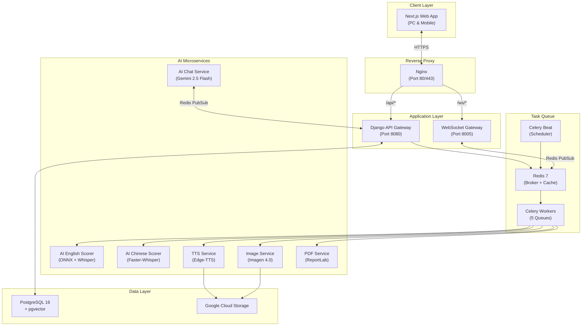

# ĐẶC TẢ YÊU CẦU PHẦN MỀM (SRS) — XIAOYUEDICT

> **Software Requirements Specification**
> **Phiên bản:** 1.0 | **Ngày:** 2026-07-25
> **Dự án:** XiaoYueDict — Ứng dụng từ điển & học ngôn ngữ tích hợp AI
> **Nhóm phát triển:** XiaoYue Team

---

## 1. Giới Thiệu

### 1.1. Mục đích tài liệu
Tài liệu này mô tả đầy đủ các yêu cầu chức năng (Functional Requirements) và phi chức năng (Non-Functional Requirements) của hệ thống **XiaoYueDict** — một ứng dụng web tra cứu từ điển song ngữ Trung-Việt & Anh-Việt tích hợp trí tuệ nhân tạo (AI) hỗ trợ người học luyện phát âm, luyện viết, làm bài thi HSK, và tương tác với gia sư AI cá nhân hóa.

### 1.2. Phạm vi hệ thống
XiaoYueDict bao gồm:
- **Ứng dụng Web (Frontend):** Next.js 14 + TypeScript + TailwindCSS
- **API Gateway (Backend):** Django REST Framework + Celery
- **Microservices AI:** FastAPI (Pronunciation Scoring EN/ZH, TTS, Image Generation, PDF Rendering, AI Chat)
- **Infrastructure:** Docker Compose, Nginx, PostgreSQL 16 + pgvector, Redis 7, Google Cloud Platform

### 1.3. Đối tượng người dùng

| Vai trò | Mô tả |
|---|---|
| **Guest** | Người dùng chưa đăng nhập, truy cập hạn chế (tra từ, luyện phát âm giới hạn) |
| **Free User** | Đã đăng ký, sử dụng cơ bản với giới hạn bandwidth/coin |
| **Plus User** | Gói trả phí, mở rộng giới hạn và ưu tiên queue |
| **Pro User** | Gói cao cấp, giới hạn cao hơn |
| **Premium User** | Gói tối ưu, không giới hạn |
| **Admin** | Quản trị viên, quản lý nội dung, xử lý ticket, cấu hình hệ thống |

### 1.4. Định nghĩa & Viết tắt

| Thuật ngữ | Định nghĩa |
|---|---|
| HSK | Hanyu Shuiping Kaoshi — Kỳ thi năng lực tiếng Trung quốc tế |
| CEFR | Common European Framework of Reference — Khung năng lực ngoại ngữ châu Âu |
| RAG | Retrieval-Augmented Generation — Kỹ thuật truy xuất bổ trợ sinh văn bản |
| TTS | Text-to-Speech — Chuyển văn bản thành giọng nói |
| ASR | Automatic Speech Recognition — Nhận dạng giọng nói tự động |
| pgvector | Extension PostgreSQL hỗ trợ vector similarity search |
| SePay | Cổng thanh toán tự động qua QR chuyển khoản ngân hàng |

---

## 2. Tổng Quan Hệ Thống

### 2.1. Kiến trúc tổng thể

### 2.2. Thống kê quy mô

| Chỉ số | Giá trị |
|---|---|
| Django Apps | 16 |
| Source files | ~160 |
| API Endpoints | 90+ (16 namespaces) |
| Docker containers (full stack) | 17 |
| Celery scheduled tasks | 6 |
| Celery async task types | 13 |
| Database models | 40+ |
| Total Commits | 125+ |

---

## 3. Yêu Cầu Chức Năng (Functional Requirements)

### FR-01: Tra cứu Từ điển Song ngữ

| ID | Yêu cầu | Độ ưu tiên |
|---|---|---|
| FR-01.1 | Hệ thống cho phép tìm kiếm từ vựng tiếng Trung theo: Hán tự, Pinyin, Hán Việt, nghĩa tiếng Việt | **Cao** |
| FR-01.2 | Hỗ trợ tìm kiếm mờ (fuzzy search) bằng pg_trgm trigram matching | **Cao** |
| FR-01.3 | Hỗ trợ full-text search trên câu ví dụ bằng jieba tokenization (ZH) và tsvector config English (EN) | **Cao** |
| FR-01.4 | Hệ thống cho phép tìm kiếm từ vựng tiếng Anh theo: từ khóa, IPA, nghĩa tiếng Việt | **Cao** |
| FR-01.5 | Hỗ trợ batch search (tra cứu nhiều từ cùng lúc) | **Trung bình** |
| FR-01.6 | Hỗ trợ tìm kiếm theo bộ thủ (radical) cho tiếng Trung | **Trung bình** |
| FR-01.7 | Hiển thị thông tin chi tiết: pinyin, Hán Việt, nghĩa, từ loại, HSK/CEFR level, đồng/trái nghĩa, câu ví dụ, hình ảnh minh họa, audio phát âm | **Cao** |
| FR-01.8 | Hỗ trợ phát âm TTS (Edge-TTS neural voice) cho từ và câu ví dụ | **Cao** |

### FR-02: Dịch thuật AI

| ID | Yêu cầu | Độ ưu tiên |
|---|---|---|
| FR-02.1 | Hệ thống hỗ trợ dịch văn bản tự do Trung → Việt bằng Gemini AI | **Cao** |
| FR-02.2 | Hỗ trợ dịch Anh → Việt | **Cao** |
| FR-02.3 | Dịch thuật được xử lý bất đồng bộ (Celery task) với polling trạng thái | **Cao** |
| FR-02.4 | Giới hạn ký tự dịch theo tier đăng ký (zh: 150-500 chars, en: 300-1000 chars) | **Cao** |
| FR-02.5 | Cache kết quả dịch trong Redis để tránh duplicate API calls | **Trung bình** |

### FR-03: Đánh giá Phát âm AI

| ID | Yêu cầu | Độ ưu tiên |
|---|---|---|
| FR-03.1 | Người dùng có thể ghi âm giọng nói trực tiếp qua trình duyệt (Web Audio API + MediaRecorder) | **Cao** |
| FR-03.2 | Upload audio file (webm/wav, max 20MB) để AI chấm điểm phát âm | **Cao** |
| FR-03.3 | AI trả về điểm tổng (0-100) và điểm chi tiết từng âm tiết/phoneme | **Cao** |
| FR-03.4 | Hỗ trợ chấm điểm tiếng Anh (ONNX FP16 + Whisper ASR) và tiếng Trung (Faster-Whisper) | **Cao** |
| FR-03.5 | Phân luồng queue theo tier: Paid → queue_paid (ưu tiên), Free → queue_free, Guest → queue_guest | **Cao** |
| FR-03.6 | Thông báo kết quả realtime qua WebSocket | **Cao** |
| FR-03.7 | Hiển thị kết quả trực quan: vòng tròn điểm SVG, màu sắc phân tách theo mức (excellent/good/moderate/poor) | **Cao** |
| FR-03.8 | Hỗ trợ hoàn trả coin khi chấm điểm thất bại | **Trung bình** |

### FR-04: Luyện thi HSK

| ID | Yêu cầu | Độ ưu tiên |
|---|---|---|
| FR-04.1 | Hỗ trợ đề thi HSK cấp 1, 3, 4, 6, 7-9 (chuẩn 2026) | **Cao** |
| FR-04.2 | Hỗ trợ 6 loại câu hỏi: true_false, multiple_choice, fill_blank, matching, ordering, essay | **Cao** |
| FR-04.3 | Bộ phát audio thông minh kép: Main Audio Player + Segment Audio Player (trích đoạn theo mốc thời gian) | **Cao** |
| FR-04.4 | Đa giao diện ngôn ngữ: English UI & Chinese UI với pinyin ruby annotation | **Cao** |
| FR-04.5 | Auto-save tiến trình làm bài vào localStorage (resume khi refresh/mất kết nối) | **Cao** |
| FR-04.6 | Đếm ngược thời gian thi, tự động nộp khi hết giờ | **Cao** |
| FR-04.7 | Bảng điều khiển câu hỏi: đánh dấu màu câu đã làm/chưa làm, đúng/sai sau nộp bài | **Cao** |
| FR-04.8 | Image Lightbox & Zoom cho hình ảnh đề bài | **Trung bình** |
| FR-04.9 | Responsive layout: dual-column (PC) vs single-column (Mobile) | **Cao** |
| FR-04.10 | Tích hợp Gamification: cộng XP + streak sau khi nộp bài thành công | **Trung bình** |

### FR-05: Sổ tay Từ vựng & Xuất PDF

| ID | Yêu cầu | Độ ưu tiên |
|---|---|---|
| FR-05.1 | CRUD sổ tay từ vựng (tạo, sửa, xóa sổ tay và từ trong sổ) | **Cao** |
| FR-05.2 | Đánh dấu từ "đã thuộc" (is_mastered) | **Trung bình** |
| FR-05.3 | Xuất sổ tay ra PDF bất đồng bộ (ReportLab + Noto Sans CJK) | **Cao** |
| FR-05.4 | Hỗ trợ 2 kiểu PDF: thường và phân rã nét (stroke decomposition) | **Trung bình** |
| FR-05.5 | Giới hạn xuất PDF theo tier (số lần/ngày, số từ/file) | **Cao** |
| FR-05.6 | Hệ thống sổ tay mặc định (system notebooks) theo HSK level, cho phép clone vào tài khoản cá nhân | **Trung bình** |

### FR-06: Bài tập Flashcard AI

| ID | Yêu cầu | Độ ưu tiên |
|---|---|---|
| FR-06.1 | AI sinh bài tập reading quiz và listening quiz cho từng từ vựng (Gemini AI) | **Cao** |
| FR-06.2 | Cache bài tập vĩnh viễn (1 lần sinh, dùng mãi) | **Cao** |
| FR-06.3 | Lưu lịch sử hoàn thành bài tập (giới hạn 10 records/từ/user) | **Trung bình** |
| FR-06.4 | Luyện viết sâu theo từ: AI chấm điểm ngữ pháp, từ vựng, cấu trúc (trừ coin) | **Cao** |
| FR-06.5 | Luyện viết tự do: AI chấm điểm tổng thể | **Trung bình** |

### FR-07: Hình ảnh Minh họa AI

| ID | Yêu cầu | Độ ưu tiên |
|---|---|---|
| FR-07.1 | Tự động sinh hình ảnh minh họa cho từ vựng bằng Imagen 4.0 | **Trung bình** |
| FR-07.2 | Upload và lưu trữ trên Google Cloud Storage | **Cao** |
| FR-07.3 | Cache URL hình ảnh trong Redis (5 min TTL) | **Trung bình** |
| FR-07.4 | Hỗ trợ báo cáo hình ảnh sai/không phù hợp | **Thấp** |
| FR-07.5 | Regenerate hình ảnh khi bị báo cáo | **Thấp** |

### FR-08: Đăng ký & Thanh toán

| ID | Yêu cầu | Độ ưu tiên |
|---|---|---|
| FR-08.1 | 4 gói đăng ký: Free, Plus, Pro, Premium | **Cao** |
| FR-08.2 | Thanh toán tự động qua SePay (QR chuyển khoản ngân hàng VN) | **Cao** |
| FR-08.3 | Webhook callback xác nhận thanh toán thành công | **Cao** |
| FR-08.4 | Tự động xử lý hết hạn đăng ký (Celery Beat: daily 00:30) | **Cao** |
| FR-08.5 | Hỗ trợ nâng cấp, gia hạn, hạ cấp (pending_downgrade_tier) | **Cao** |
| FR-08.6 | Tự động cleanup đơn PENDING quá 15 phút (Celery Beat: mỗi 5 phút) | **Trung bình** |
| FR-08.7 | Lịch sử thay đổi gói (SubscriptionHistory) | **Trung bình** |
| FR-08.8 | Volume Limit: giới hạn bandwidth theo tier (MB/phút, MB/giờ, MB/ngày) | **Cao** |

### FR-09: Game hóa (Gamification)

| ID | Yêu cầu | Độ ưu tiên |
|---|---|---|
| FR-09.1 | Hệ thống Streak (chuỗi học tập liên tiếp): current_streak, max_streak | **Cao** |
| FR-09.2 | Mục tiêu hàng ngày (daily target): số từ hoặc thời gian | **Trung bình** |
| FR-09.3 | Lịch hoạt động (activity calendar) | **Trung bình** |
| FR-09.4 | Ví Coin dual-currency: paid_balance (refill/mua), free_balance (kiếm từ học), shop_balance (Thần thạch) | **Cao** |
| FR-09.5 | Coin transaction logging chi tiết (audit trail) | **Cao** |
| FR-09.6 | Hồi coin hàng tuần (weekly refill) theo tier | **Cao** |
| FR-09.7 | Phiên học flashcard (StudySession): tracking thẻ đã lật, coin kiếm được | **Cao** |
| FR-09.8 | Mua coin bằng tiền thật qua SePay | **Trung bình** |
| FR-09.9 | Hệ thống Level & EXP theo ngôn ngữ | **Cao** |
| FR-09.10 | EXP transaction idempotent (tránh duplicate khi Celery retry) | **Cao** |
| FR-09.11 | Hệ thống phần thưởng: RewardItem (avatar frame, title, badge, cosmetic) + RewardRule (level milestone) | **Trung bình** |
| FR-09.12 | Cửa hàng vật phẩm (Shop): mua bằng paid/free/shop coin | **Trung bình** |
| FR-09.13 | Kho vật phẩm (Inventory): equip/unequip items | **Trung bình** |

### FR-10: AI Chat (XiaoYue Tutor)

| ID | Yêu cầu | Độ ưu tiên |
|---|---|---|
| FR-10.1 | Tạo AI Persona với tính cách tùy chỉnh (cold/cheerful/strict/gentle) | **Cao** |
| FR-10.2 | Hỗ trợ nhiều context: wuxia (kiếm hiệp), modern, academic | **Trung bình** |
| FR-10.3 | Emotional state machine: joy/sad sensitivity, decay rate | **Trung bình** |
| FR-10.4 | Streaming response qua WebSocket + Redis PubSub | **Cao** |
| FR-10.5 | RAG memory system: pgvector embeddings (768d) + text-embedding-004 | **Cao** |
| FR-10.6 | Periodic summarization: tóm tắt 6 tin nhắn → embedding vector | **Trung bình** |
| FR-10.7 | Persistent chat history (evict từ Redis → PostgreSQL) | **Cao** |
| FR-10.8 | Trừ coin khi tạo persona + gửi tin nhắn | **Cao** |

### FR-11: Cộng đồng (Community)

| ID | Yêu cầu | Độ ưu tiên |
|---|---|---|
| FR-11.1 | Bình luận trên từ vựng (mỗi user 1 comment/từ) với upvote/downvote | **Trung bình** |
| FR-11.2 | Diễn đàn: CRUD bài đăng (hỗ trợ 1 ảnh upload lên GCS) | **Trung bình** |
| FR-11.3 | Like, Bookmark bài đăng | **Trung bình** |
| FR-11.4 | Bình luận trên bài đăng + Like bình luận | **Trung bình** |
| FR-11.5 | Auto-hide khi nội dung bị ≥5 reports | **Cao** |
| FR-11.6 | Hệ thống khiếu nại (Appeal) cho nội dung bị ẩn | **Trung bình** |
| FR-11.7 | Coin reward tự động qua signals khi có tương tác | **Thấp** |

### FR-12: Bảng xếp hạng (Leaderboard)

| ID | Yêu cầu | Độ ưu tiên |
|---|---|---|
| FR-12.1 | 5 bảng xếp hạng: coin_paid, coin_free, total_likes, weekly_words, max_streak | **Trung bình** |
| FR-12.2 | Snapshot mỗi 4 giờ bởi Celery Beat | **Trung bình** |
| FR-12.3 | Cleanup snapshot cũ mỗi ngày (01:30) | **Thấp** |
| FR-12.4 | Denormalized data (username, avatar) để tránh JOIN queries | **Trung bình** |

### FR-13: Thông báo (Notifications)

| ID | Yêu cầu | Độ ưu tiên |
|---|---|---|
| FR-13.1 | Push notification qua WebSocket (realtime) | **Cao** |
| FR-13.2 | Persistent notification trong DB (không mất khi offline) | **Cao** |
| FR-13.3 | Types: score_complete/failed, streak_update, subscription_change, achievement, system, pdf_complete/failed | **Cao** |
| FR-13.4 | Mark read / Mark all read | **Trung bình** |
| FR-13.5 | TTL expiry cho notification (e.g., PDF download link 1h) | **Thấp** |

### FR-14: Báo lỗi & Hỗ trợ

| ID | Yêu cầu | Độ ưu tiên |
|---|---|---|
| FR-14.1 | Báo lỗi nội dung: hình sai, dịch sai, pinyin sai, audio hỏng (hỗ trợ Guest) | **Trung bình** |
| FR-14.2 | Đề xuất tính năng mới (Feature Report) | **Thấp** |
| FR-14.3 | Yêu cầu hỗ trợ kỹ thuật (Support Ticket) với comment thread | **Trung bình** |
| FR-14.4 | Phân biệt ghi chú nội bộ admin (is_internal) vs phản hồi công khai | **Trung bình** |
| FR-14.5 | Guest ticket verification qua email | **Thấp** |

### FR-15: Xác thực & Bảo mật

| ID | Yêu cầu | Độ ưu tiên |
|---|---|---|
| FR-15.1 | Firebase Authentication (Google, Email) | **Cao** |
| FR-15.2 | JWT trong httpOnly Secure cookies (CookieJWTAuthentication) | **Cao** |
| FR-15.3 | Guest support qua X-Guest-ID header với IDOR protection | **Cao** |
| FR-15.4 | CORS: explicit origins + Vercel preview regex | **Cao** |
| FR-15.5 | CSRF protection | **Cao** |
| FR-15.6 | Rate limiting: anon=30/min, user=60/min | **Cao** |
| FR-15.7 | Volume limiting middleware (bandwidth tracking per tier) | **Cao** |
| FR-15.8 | HSTS 1 year + preload + subdomains | **Cao** |

---

## 4. Yêu Cầu Phi Chức Năng (Non-Functional Requirements)

### NFR-01: Hiệu năng (Performance)

| ID | Yêu cầu | Chỉ số |
|---|---|---|
| NFR-01.1 | Thời gian phản hồi API trung bình | < 200ms (p95) |
| NFR-01.2 | Thời gian tìm kiếm từ điển | < 100ms (cached), < 500ms (cold) |
| NFR-01.3 | Thời gian chấm điểm phát âm | < 30 giây (end-to-end) |
| NFR-01.4 | Concurrent WebSocket connections | ≥ 500 |
| NFR-01.5 | Database query performance | No N+1 queries (select_related/prefetch_related) |

### NFR-02: Khả năng mở rộng (Scalability)

| ID | Yêu cầu |
|---|---|
| NFR-02.1 | Celery workers scale horizontally (thêm container khi tải tăng) |
| NFR-02.2 | Redis cluster-ready architecture |
| NFR-02.3 | Stateless API Gateway (load balancer compatible) |
| NFR-02.4 | GCS cho media storage (unlimited scalability) |

### NFR-03: Độ tin cậy (Reliability)

| ID | Yêu cầu |
|---|---|
| NFR-03.1 | Uptime target: 99.5% |
| NFR-03.2 | Auto-restart containers (`restart: unless-stopped`) |
| NFR-03.3 | Health checks cho tất cả critical services (Redis, DB, AI services) |
| NFR-03.4 | Idempotent Celery tasks (EXP transaction, reward distribution) |
| NFR-03.5 | Graceful degradation khi AI services offline (`AI_SERVICE_AVAILABLE` flag) |

### NFR-04: Bảo mật (Security)

| ID | Yêu cầu |
|---|---|
| NFR-04.1 | Tất cả secrets qua environment variables, không hardcode |
| NFR-04.2 | Database chỉ expose qua internal Docker network |
| NFR-04.3 | HTTPS enforced (Cloudflare SSL termination) |
| NFR-04.4 | SQL injection prevention (Django ORM, parameterized queries) |
| NFR-04.5 | XSS protection via Content Security Policy |
| NFR-04.6 | Rate limiting tại Nginx layer (community image upload: 5 req/min) |

### NFR-05: Khả dụng (Usability)

| ID | Yêu cầu |
|---|---|
| NFR-05.1 | Responsive design: PC (dual-column) + Mobile (single-column) |
| NFR-05.2 | Prevent auto-zoom trên iOS Safari (min font-size 16px) |
| NFR-05.3 | Touch-friendly controls (min spacing 12px giữa các nút) |
| NFR-05.4 | Glassmorphic UI với micro-animations |
| NFR-05.5 | Dual language UI (Vietnamese/Chinese) |
| NFR-05.6 | Offline resilience: localStorage state persistence cho thi cử |

### NFR-06: Khả năng bảo trì (Maintainability)

| ID | Yêu cầu |
|---|---|
| NFR-06.1 | Modular Django app architecture (16 apps, separation of concerns) |
| NFR-06.2 | TypeScript strict mode (no `any`) |
| NFR-06.3 | Python type hints cho tất cả functions |
| NFR-06.4 | Docker Compose cho reproducible development environment |
| NFR-06.5 | Signal-based cache eviction (không cần manual cache invalidation) |

---

## 5. Ràng Buộc Hệ Thống

### 5.1. Ràng buộc Kỹ thuật

| Ràng buộc | Chi tiết |
|---|---|
| Database | PostgreSQL 16 + pgvector (bắt buộc cho RAG vectors) |
| Runtime | Python 3.10+, Node.js 18+ |
| GPU | NVIDIA GPU + CUDA required cho AI services (EN/ZH scoring) |
| Cloud | Google Cloud Platform (GCS, Gemini, Imagen, Vertex AI) |
| Auth Provider | Firebase Authentication |
| Payment Gateway | SePay (Việt Nam banking) |

### 5.2. Ràng buộc Nghiệp vụ

| Ràng buộc | Chi tiết |
|---|---|
| Ngôn ngữ hỗ trợ | Tiếng Trung (HSK 1-9), Tiếng Anh (CEFR A1-C2) |
| Thị trường | Việt Nam (VNĐ, ngân hàng Việt Nam) |
| Dữ liệu từ điển | HSK 1-6 (đã nhập), HSK 7-9 (đang bổ sung) |
| Đề thi | HSK chuẩn 2026 (5 cấp độ: 1, 3, 4, 6, 7-9) |

---

## 6. Giao Diện Ngoài (External Interfaces)

### 6.1. Giao diện Người dùng (User Interface)
- **Platform:** Web browser (Chrome, Firefox, Safari, Edge)
- **Framework:** Next.js 14 (App Router) + TypeScript + TailwindCSS
- **Design System:** Custom CSS variables + Lexend/Inter fonts + Glassmorphism
- **Responsive:** Mobile-first, breakpoint 768px

### 6.2. Giao diện Phần cứng (Hardware Interface)
- **Microphone:** Web Audio API + MediaRecorder (ghi âm phát âm)
- **GPU:** NVIDIA CUDA (AI inference services)

### 6.3. Giao diện Phần mềm (Software Interface)

| Hệ thống ngoài | Giao tiếp | Mục đích |
|---|---|---|
| Firebase Auth | REST API | Xác thực người dùng |
| Google Gemini 2.5 Flash | REST API | Dịch thuật, sinh bài tập, AI chat |
| Google Imagen 4.0 | REST API (Vertex AI) | Sinh hình ảnh minh họa |
| Google Cloud Storage | REST API | Lưu trữ media files |
| Google text-embedding-004 | REST API | Sinh vector embeddings cho RAG |
| Microsoft Edge-TTS | Python SDK | Text-to-Speech neural voices |
| SePay | Webhook callback | Xác nhận thanh toán |
| Azure Speech SDK | REST API | Speech token (Azure pronunciation) |

### 6.4. Giao diện Truyền thông (Communication Interface)

| Protocol | Mục đích |
|---|---|
| HTTPS (443) | Client ↔ Nginx ↔ Django API |
| WSS | Client ↔ Nginx ↔ WebSocket Gateway |
| HTTP (internal) | Django/Celery ↔ AI Microservices (Docker DNS) |
| Redis PubSub | Django ↔ WebSocket Gateway, Django ↔ AI Chat Service |
| Redis Queue | Django → Celery Broker → Workers |

---

## 7. Celery Task Scheduling (Tác vụ Định kỳ)

| Task | Lịch trình | Mô tả |
|---|---|---|
| `calculate_daily_streaks` | Mỗi ngày 00:00 | Tính chuỗi học tập |
| `process_expired_subscriptions` | Mỗi ngày 00:30 | Xử lý gói hết hạn |
| `purge_old_pdf_exports` | Mỗi giờ | Xóa file PDF cũ |
| `expire_pending_payment_orders` | Mỗi 5 phút | Hủy đơn thanh toán quá hạn |
| `refresh_all_leaderboards` | Mỗi 4 giờ | Snapshot bảng xếp hạng |
| `cleanup_old_leaderboard_snapshots` | Mỗi ngày 01:30 | Xóa snapshot cũ |

---

## 8. Ma Trận Truy Xuất Nguồn Gốc (Traceability Matrix)

| Use Case | Functional Req | API Endpoint | Database Model |
|---|---|---|---|
| Tra từ tiếng Trung | FR-01.1, FR-01.2 | `GET /dictionary/zh/search/` | ZhWord, ZhExample |
| Ghi âm phát âm | FR-03.1, FR-03.2 | `POST /assessments/submit/` | AssessmentTask |
| Làm bài thi HSK | FR-04.1 → FR-04.9 | `GET /exams/{id}/` | Exam, Section, Question, Option |
| Xuất PDF sổ tay | FR-05.3, FR-05.4 | `POST /notes/.../export-pdf/` | PDFExportTask |
| Chat AI tutor | FR-10.1 → FR-10.8 | `POST /xiaoyue-chat/send/` | ChatPersona, ChatMessage, ChatSummary |
| Thanh toán gói | FR-08.2, FR-08.3 | `POST /subscriptions/register/` | PaymentOrder, UserSubscription |
| Mua vật phẩm | FR-09.12 | `POST /gamification/shop/purchase/` | RewardItem, UserInventory, CoinTransaction |

---

## 9. Phụ Lục

### A. Danh sách Docker Containers (17)

| Container | Port | Vai trò |
|---|---|---|
| nginx | 80 | Reverse proxy |
| redis | — | Message broker + Cache |
| db | 5432 | PostgreSQL + pgvector |
| core-django | 8080 | Django API Gateway |
| celery-worker-core | — | Core tasks |
| celery-worker-priority | — | Paid-tier scoring |
| celery-worker-standard | — | Paid + Free scoring |
| celery-worker-guest | — | Guest + Free scoring |
| celery-worker-chat | — | AI Chat RAG |
| celery-beat | — | Scheduler |
| ai-service-en | 8000 | English AI (GPU) |
| ai-service-zh | 8001 | Chinese AI (GPU) |
| tts-service | 8002 | Text-to-Speech |
| image-service | 8003 | Image generation |
| pdf-service | 8082 | PDF rendering |
| ws-gateway | 8005 | WebSocket |
| ai-chat-service | — | AI Chat streaming |

### B. Bảng Phân quyền theo Tier

| Tính năng | Guest | Free | Plus | Pro | Premium |
|---|---|---|---|---|---|
| Tra từ điển | [x] | [x] | [x] | [x] | [x] |
| Luyện phát âm | Giới hạn | Giới hạn | Mở rộng | Cao | Không giới hạn |
| Dịch thuật AI | [-] | Giới hạn | Mở rộng | Cao | Không giới hạn |
| Flashcard AI | [-] | [x] | [x] | [x] | [x] |
| Luyện viết AI | [-] | Trừ coin | Trừ coin | Trừ coin | Trừ coin |
| AI Chat | [-] | Trừ coin | Trừ coin | Trừ coin | Trừ coin |
| Xuất PDF | [-] | 2/ngày | 5/ngày | 10/ngày | 20/ngày |
| Làm bài thi | [x] | [x] | [x] | [x] | [x] |
| Cộng đồng | [-] | [x] | [x] | [x] | [x] |
| Queue ưu tiên | queue_guest | queue_free | queue_paid | queue_paid | queue_paid |